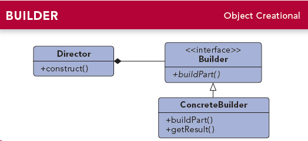

# 建造者模式

## 模式定义
建造者模式（Builder Pattern）：将一个复杂对象的构建与它的表示分离，使得同样的构建过程可以创建不同的表示。

建造者模式是一步一步创建一个复杂的对象，它允许用户只通过指定复杂对象的类型和内容就可以构建他们，用户不需要知道内部的具体构建细节。建造者模式属于对象创建型模式。

## 模式结构

建造者模式包含如下角色：

* Builder：抽象建造者
* ConcreteBuilder：具体建造者
* Director：指挥者
* Product：产品角色

## UML类图

## 模式分析

抽象建造者类中定义了产品的创建和返回方法；

建造者模式的结构中还引入了一个指挥者类Director，该类的作用主要有两个：一方面它隔离了客户与生产过程；另一方面它负责控制产品的生成过程。指挥者针对抽象建造者编程，客户端只需要知道具体建造者的类型，即可通过指挥者类调用建造者的相关方法，返回一个完整的产品对象；

在客户端代码中，无须关心产品对象的具体组装过程，只需确定具体建造者的类型即可，建造者模式将复杂对象的创建与对象的表现分离开，这样使得同样的构建过程可以创建出不同的表现。

## 优缺点分析

### 优点
* 在建造者模式中，<b>客户端不必知道产品内部组成的细节，将产品本身与产品的创建过程解耦，使得相同的创建过程可以创建不同的产品对象。</b>
* 每一个具体建造者都相对独立，而与其他的具体建造者无关，因此可以很方便地替换具体建造者或增加新的具体建造者，<b>用户使用不同的具体建造者即可得到不同的产品对象。</b>
* <b>可以更加精细地控制产品的创建过程。</b>将复杂产品的创建步骤分解在不同的方法中，使得创建过程更加清晰，也更方便使用程序来控制创建过程。
* <b>增加新的具体建造者无须修改原有类库的代码，指挥者针对抽象建造者类编程，系统扩展方便，符合"开闭原则"。</b>

### 缺点
* 建造者模式所创建的产品一般具有较多的共同点，其组成部分相似，如果产品之间的差异性很大，则不适合使用建造者模式，因此其使用范围受到一定限制。
* 如果产品的内部变化复杂，可能会导致需要定义很多具体建造者来实现这种变化，导致系统变得很庞大。

## 适用环境
