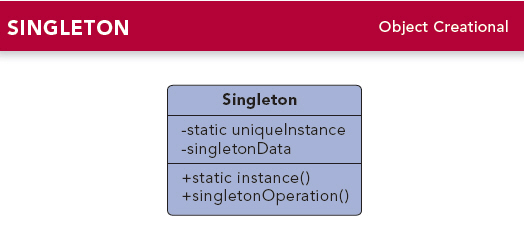

# 单例模式

## 单例模式定义

单例模式：单例模式确保某一个类只有一个实例，而且自行实例化并向整个系统提供这个实例，这个类称为单例类，它提供全局访问的方法。

单例模式的要点有三个：
1. 一个类只能有一个实例；
2. 它必须自行创建实例；
3. 它必须向整个系统提供这个实例。

## UML类图

## 模式分析

单例模式的目的是保证一个类仅有一个实例，并提供一个访问它的全局访问点。单例模式包含的角色只有一个，就是单例类--Singleton。单例类拥有一个私有的构造函数，确保用户无法通过new关键字直接实例化它。除此之外，该模式中包含一个静态私有成员变量与静态公有的工厂方法，该工厂方法负责检验实例的存在并实例化自己，然后存储在静态成员变量中，以确保只有一个实例被创建。

在单例模式中需要注意如下三点：
* 单例类的构造函数为私有；
* 提供一个自身静态私有成员变量；
* 提供一个公有的静态工厂方法。

## 优缺点分析
### 优点
* 提供了对唯一实例的受控访问。因为单例类封装了它唯一的实例，所以它可以严格控制客户怎样以及何时访问它，并为设计及开发团队提供了共享的概念。
* 由于在系统内存中只存在一个对象，因此可以节约系统资源，对于一些需要频繁创建和销毁的对象，单例模式无疑可以提高系统的性能。
* 允许可变数目的实例。我们可以基于单例模式进行扩展，使用与单例控制相似的方法来获得指定个数的对象实例。

### 缺点
* 由于单例模式中没有抽象层，因此单例类的扩展有很大难度。
* 单例类的职责过重，在一定程度上违背了"单一职责原则"。因为单例类既充当了工厂角色，提供了工厂方法，同时又充当了产品角色，包含一些业务方法，将产品的创建和产品本身的功能融合到一起。
* 滥用单例将带来一些负面问题，如为了节省资源将数据库连接池设计为单例类，可能会导致共享连接池对象的程序过多而出现连接池溢出；现在很多面向对象语言（如Java、C#）的运行环境都提供了自动垃圾回收的技术，因此，如果实例化的对象长时间不被使用，系统会认为它是系统垃圾，会自动销毁并回收资源，下次使用时又将其重新实例化，这将导致对象状态的丢失。

## 模式应用
对象创建需要耗费大量系统资源并且该对象被我们频繁使用时，如网络请求或图片加载框架类。
